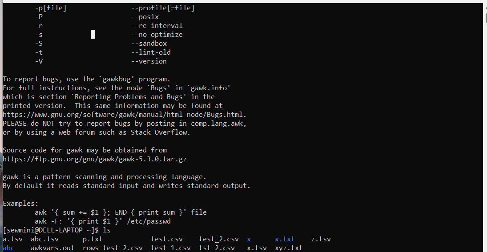

| Code Files | Outputs |
|------------|---------|
|['ageCal.txt'](./Codes/ageCal.txt)||
|['cmdCommand.txt'](./Codes/cmdCommand.txt)||
|['curDate.txt'](./Codes/curDate.txt)||
|['dayDifferent.txt'](./Codes/dayDifferent.txt)||
|['LinuxCommand.txt'](./Codes/LinuxCommand.txt)||
