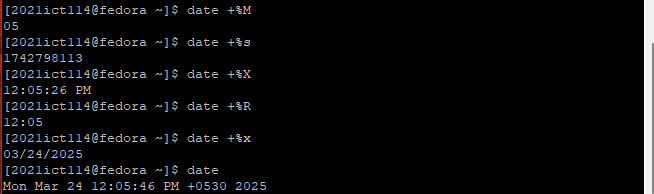

| Code Files | Outputs |
|------------|---------|
|['LinuxCommands1.txt'](./Codes/LinuxCommands1.txt)||
|['LinuxCommand2.txt'](./Codes/LinuxCommand2.txt)||
|['LinuxCommand3.txt'](./Codes/LinuxCommand3.txt)||
|['LinuxCommand4.txt'](./Codes/LinuxCommand4.txt)||
