| Code Files | Outputs |
|------------|---------|
|['LinuxCommand1.txt'](./Codes/LinuxCommand1.txt)|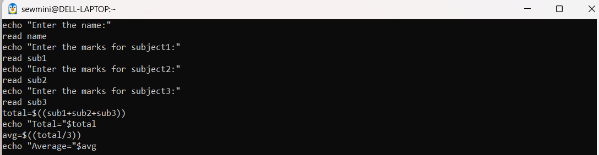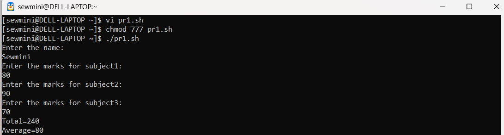|
|['LinuxCommand2.txt'](./Codes/LinuxCommand2.txt)|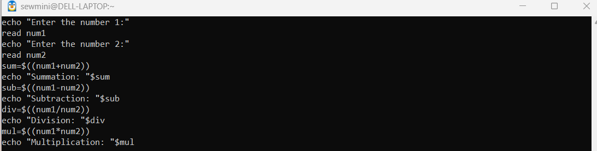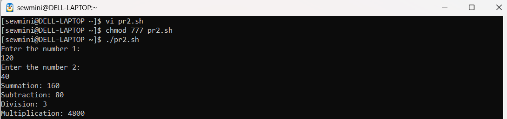|
|['LinuxCommand3.txt'](./Codes/LinuxCommand3.txt)|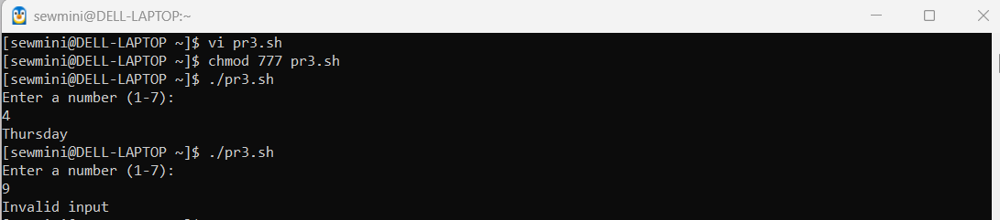|
|['LinuxCommand4.txt'](./Codes/LinuxCommand4.txt)|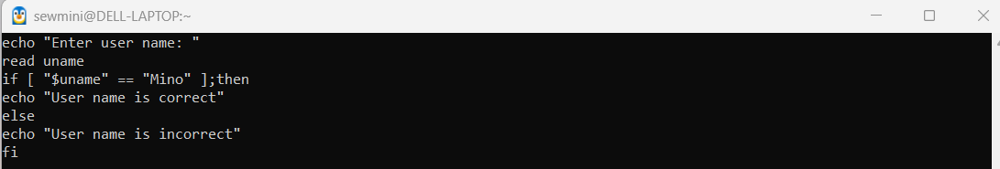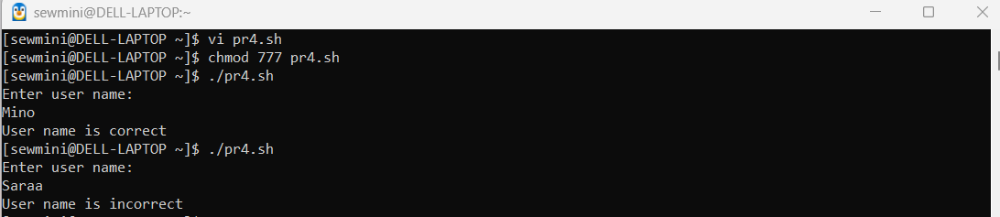|
|['LinuxCommand5.txt'](./Codes/LinuxCommand5.txt)|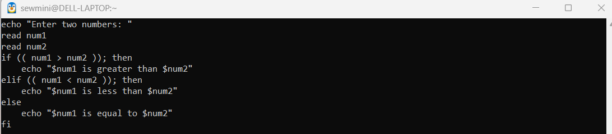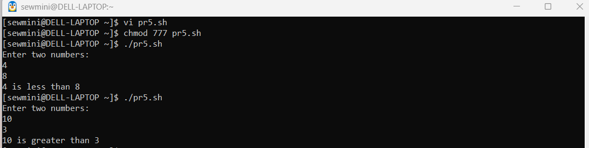|
|['LinuxCommand6.txt'](./Codes/LinuxCommand6.txt)|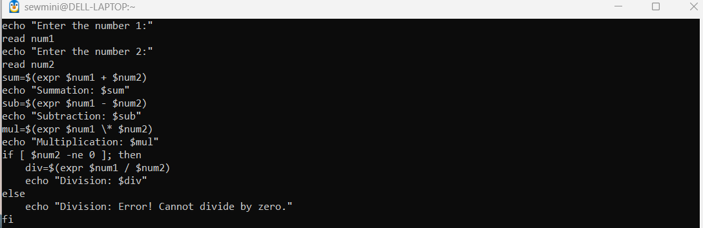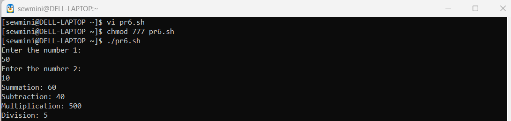|

