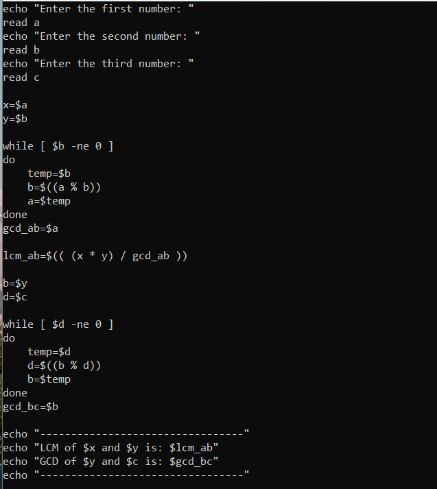
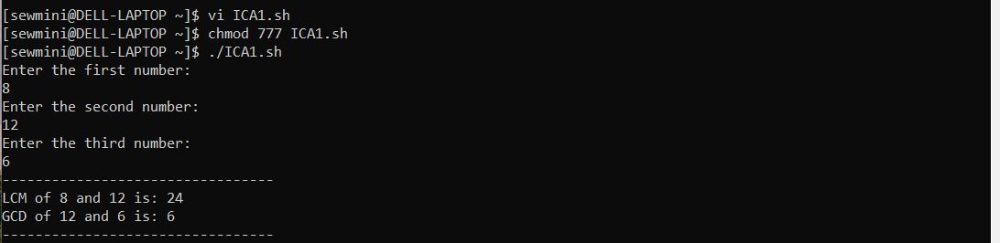
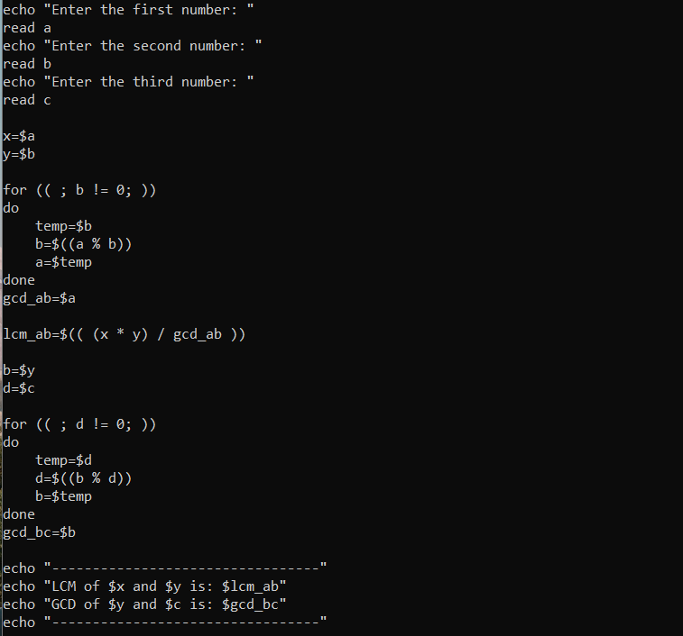
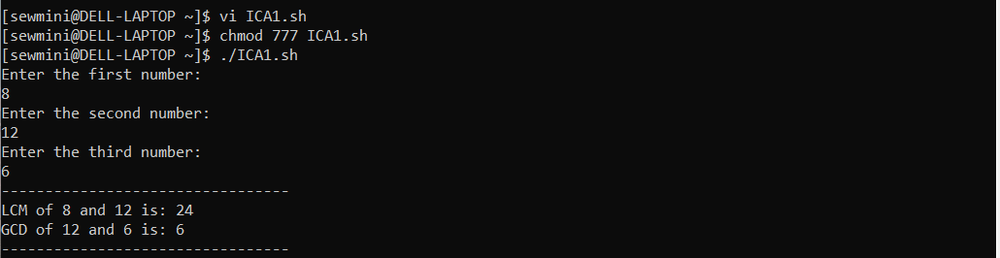
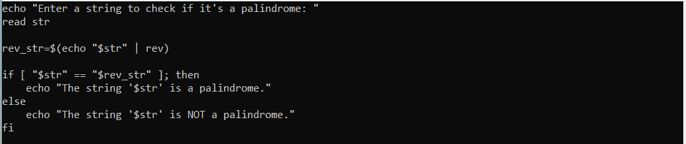
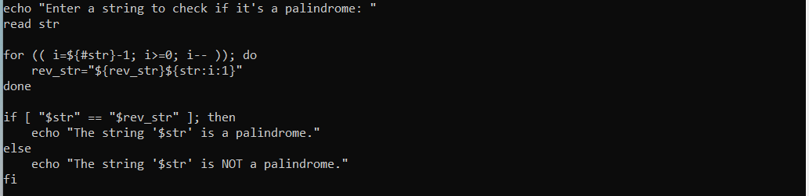

| Code Files | Outputs |
|------------|---------|
|['ICA1-1.txt'](./Codes/ICA1-1.txt)  ['ICA1-2.txt'](./Codes/ICA1-2.txt)||
|['palindrome-1.txt'](./Codes/palindrome-1.txt)  ['palindrome-2.txt'](./Codes/palindrome-2.txt)||

