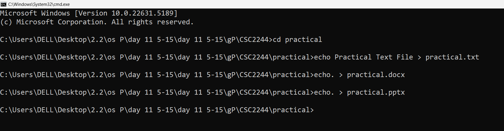
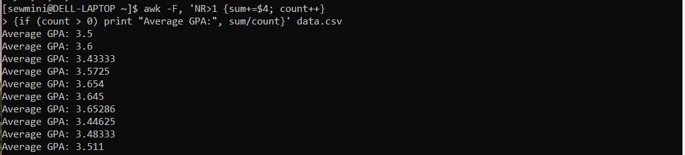

| Code Files | Outputs |
|------------|---------|
|['Answer1.txt'](./Codes/Answer1.txt)  ['IT2244(P)_ICAE1.pdf'](./Codes/IT2244(P)_ICAE1.pdf)|               |
|['Answer2.txt'](./Codes/Answer2.txt)  ['data.csv'](./Codes/data.csv)|  |
|['Answer3.txt'](./Codes/Answer3.txt)| |

