| Code Files | Outputs |
|------------|---------|
|['p1.txt'](./Codes/p1.txt)|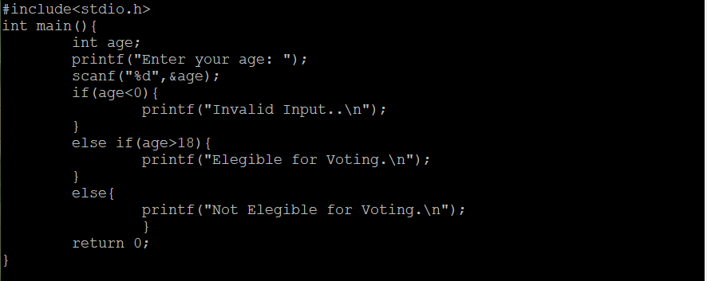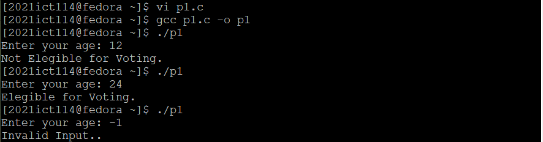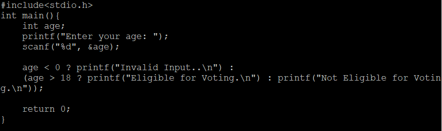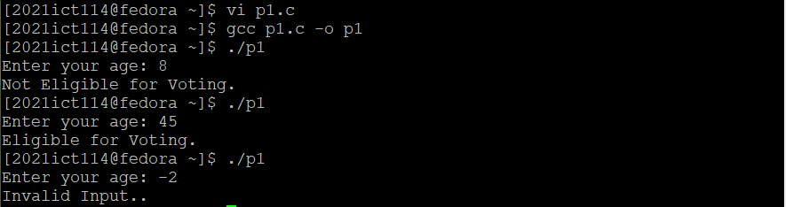|
|['p2.txt'](./Codes/p2.txt)|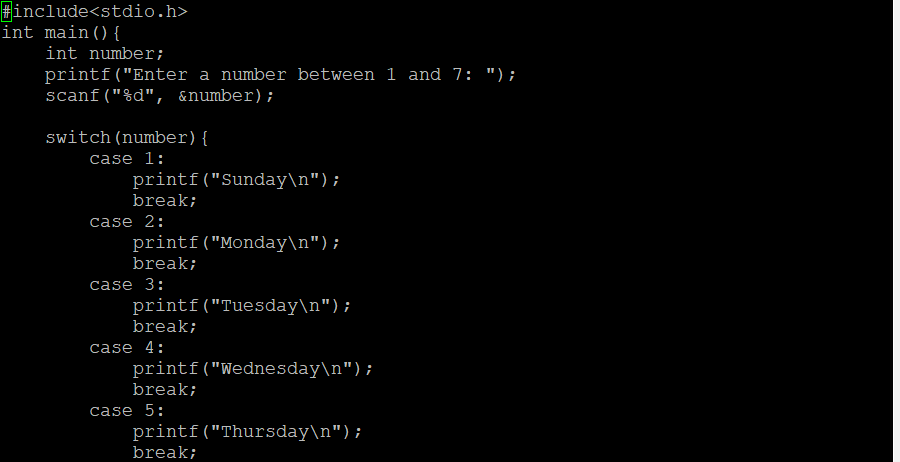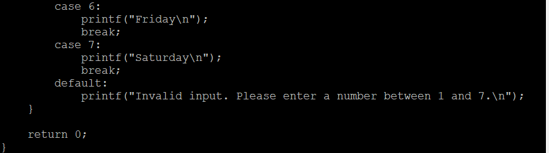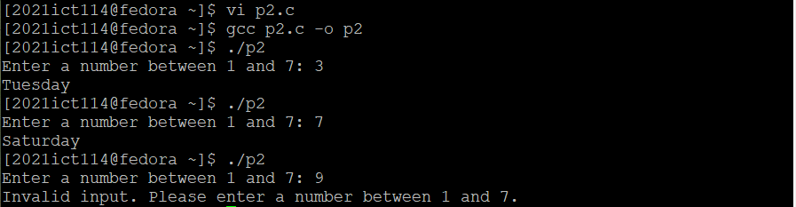|
|['p3.txt'](./Codes/p3.txt)|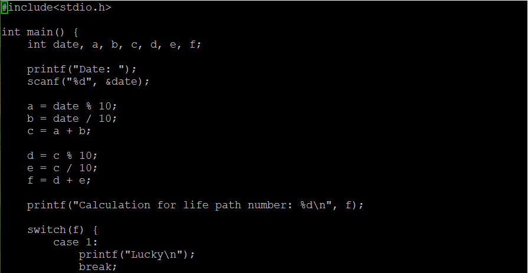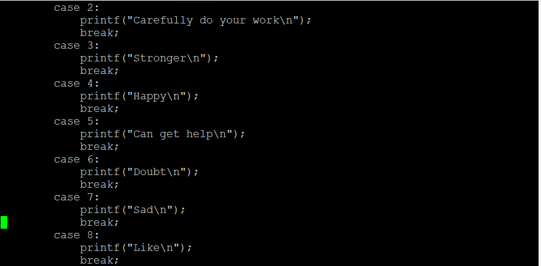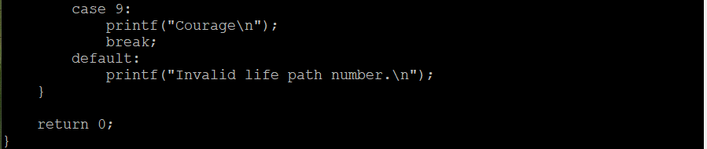|
|['p4.txt'](./Codes/p4.txt)|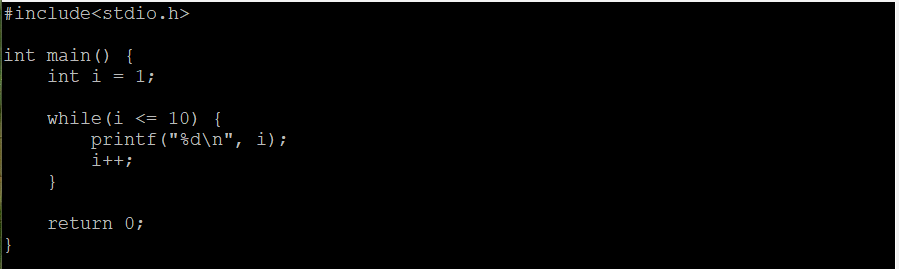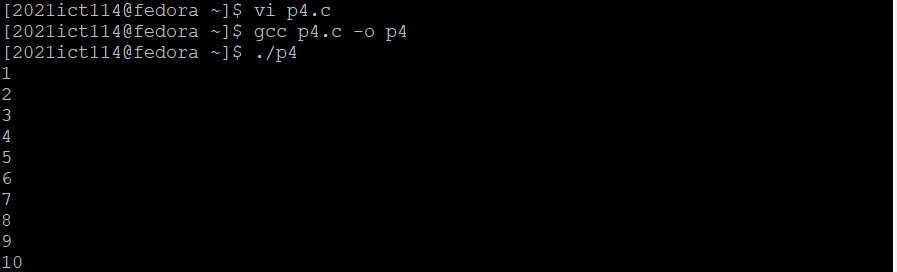|
|['p5.txt'](./Codes/p5.txt)|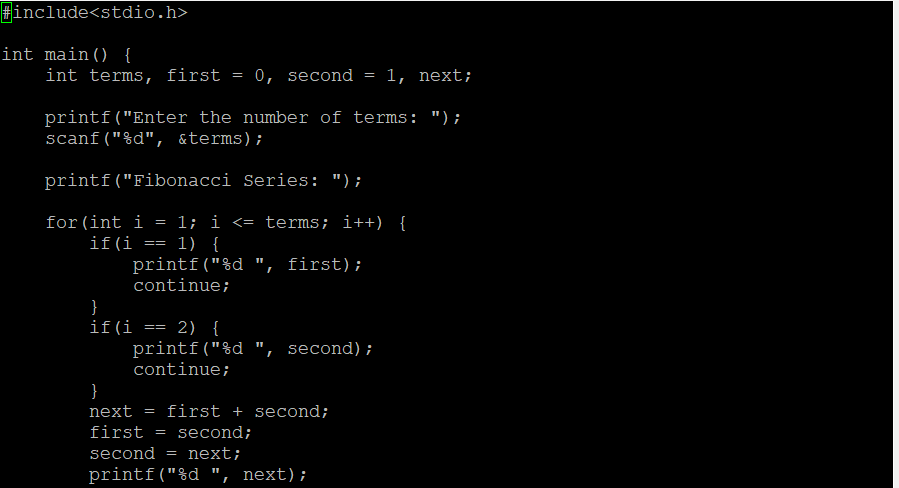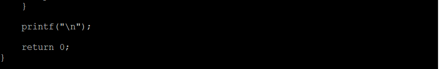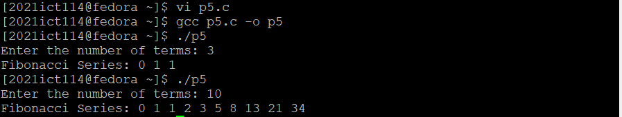|
|['p6.txt'](./Codes/p6.txt)|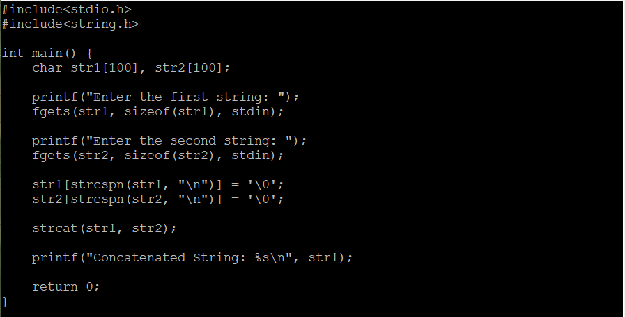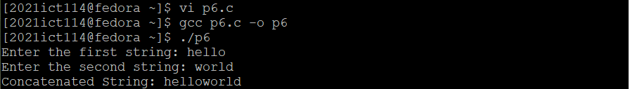|
|['p7.txt'](./Codes/p7.txt)|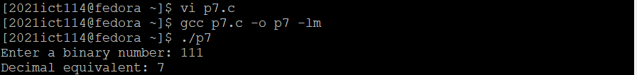|
|['p8.txt'](./Codes/p8.txt)|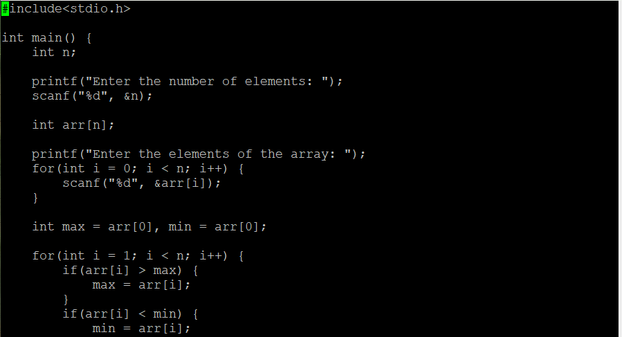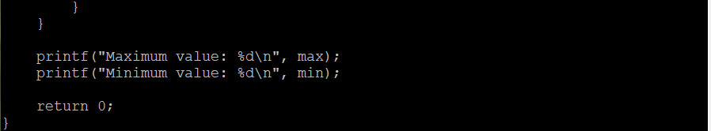|
|['p9.txt'](./Codes/p9.txt)|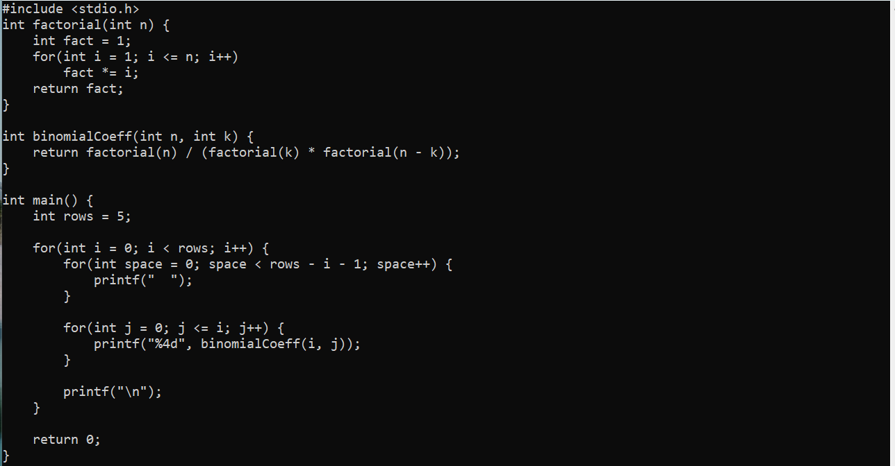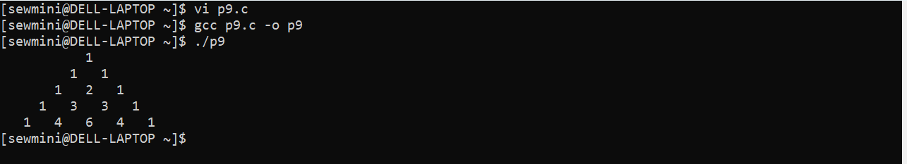|
|['p10.txt'](./Codes/p10.txt)|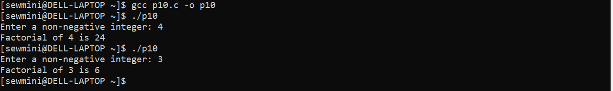|
|['p11.txt'](./Codes/p11.txt)|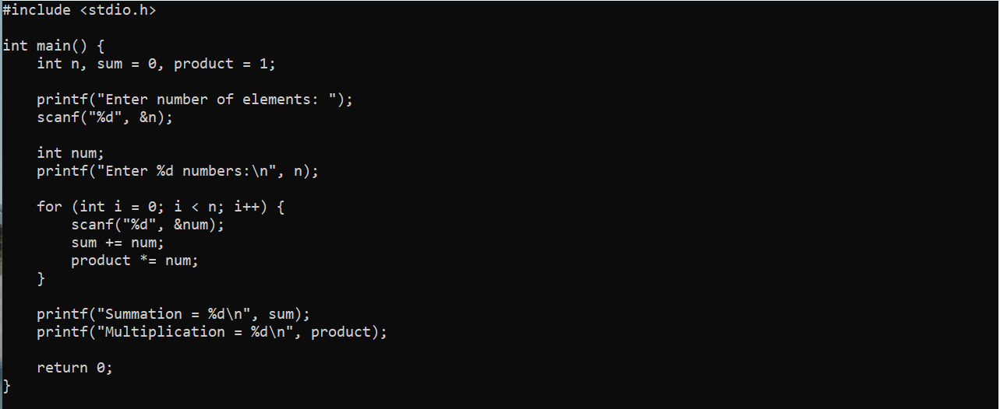|
