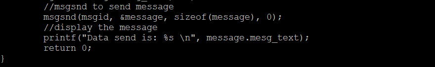
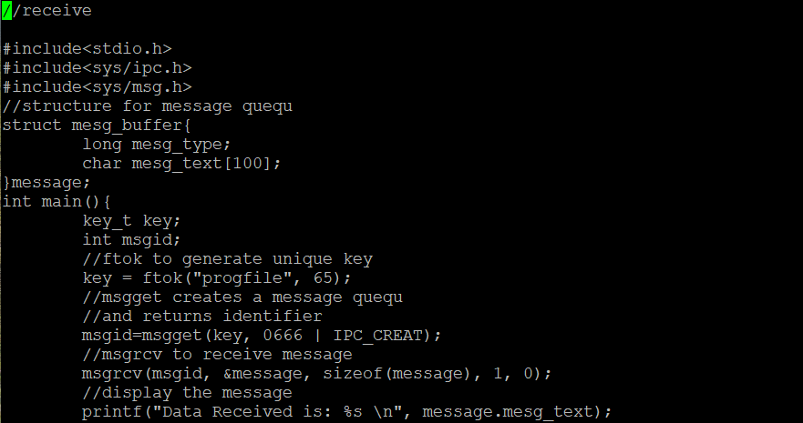
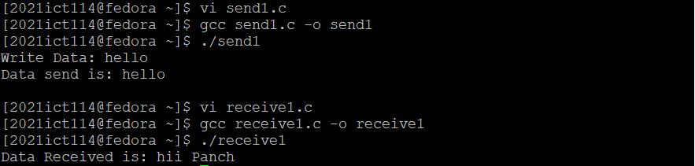
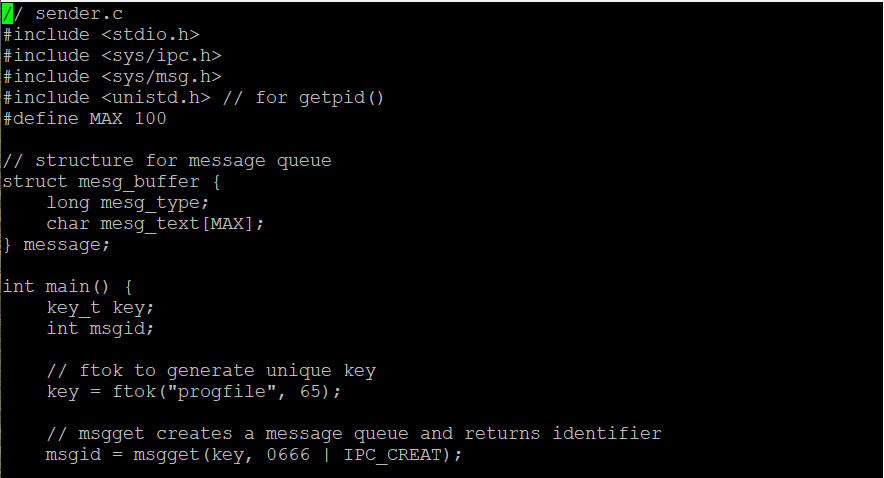
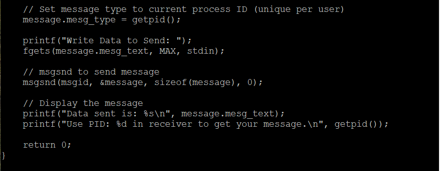
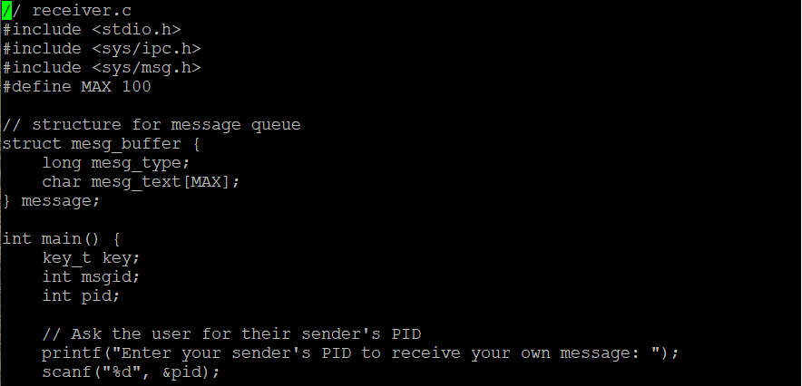
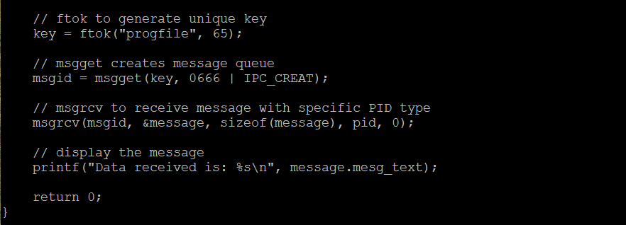
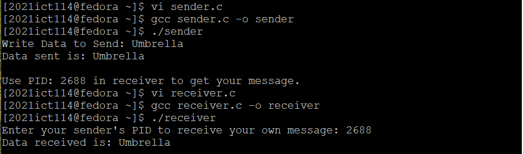

| Code Files | Outputs |
|------------|---------|
|['send_receive.c'](./Codes/send_receive.c)||
|['send1.c'](./Codes/send1.c) ['receive1.c'](./Codes/receive1.c)||
|['sender.c'](./Codes/sender.c) ['receiver.c'](./Codes/receiver.c)||

